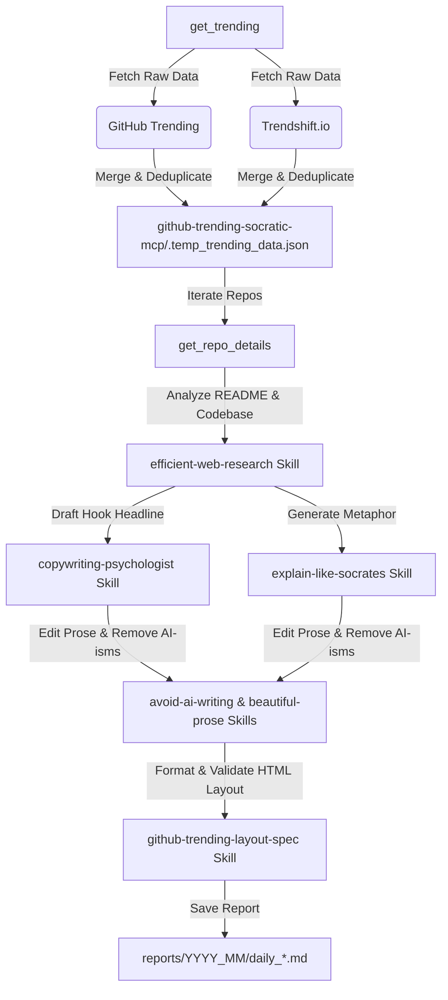

# GitHub Trending Socratic


An automated AI-powered system that retrieves, merges, and compiles daily, weekly, or monthly technology newsletters in Vietnamese. It aggregates data from both **GitHub Trending** and **Trendshift.io**, retrieves social discussion sentiment (Hacker News, Reddit, X), and leverages specialized copywriting skills to translate abstract technical jargon into accessible Socratic analogies for non-technical audiences.

---

## 🌀 `How It Works (Workflow Pipeline)`



---

## ✨ Key Features

- **🚀 Dual-Source Aggregator**: Simultaneously fetches from GitHub.com/trending and Trendshift.io to capture both raw code activity and social hype.
- **🔗 Intelligent Deduplication**: Automatically merges matching repositories, keeping GitHub statistics (stars, forks) while augmenting them with Trendshift tags and authors.
- **💬 Social Sentiment Integration**: Gathers and exposes discussion indicators from online tech hubs (Hacker News, Reddit, X) directly inside the report.
- **🧠 Socratic Copywriting Engine**: Translates complex codebases (e.g., peer-to-peer databases, WebAssembly runtimes) into everyday analogies (e.g., office assistants, refrigerator drawers).
- **📋 Premium HTML Table Layouts**: Generates strict, responsive HTML tables conforming to exact width constraints (`5% | 15% | 10% | 20% | 30% | 20%`) for a premium reading experience across all devices.
- **🛡️ Quality Assurance Linter**: Automatically validates HTML tag closure and formatting widths before publishing.

---

## 📂 Project Structure

```text
.
├── .gitignore
├── AGENTS.md
├── LICENSE
├── README.md
├── github-trending-socratic-mcp/
│   ├── index.js
│   ├── package.json
│   └── utils.js
├── reports/
└── skills/
    ├── avoid-ai-writing/
    ├── beautiful-prose/
    ├── copywriting-psychologist/
    ├── efficient-web-research/
    ├── explain-like-socrates/
    └── github-trending-layout-spec/
```


- `github-trending-socratic-mcp/`: A Node.js Model Context Protocol (MCP) server. Handles data fetching, merging, and README scraping.
- `skills/`: Folder containing the technical and style skills for the Agent:
  - `github-trending-layout-spec`: Technical table layouts, file naming rules, and validation criteria.
  - `efficient-web-research`: Token-efficient reading protocol, repository analysis, and web search guides.
  - `explain-like-socrates`: Standard Socratic analogy formulation rules.
  - `copywriting-psychologist`: Guidance for writing hook headlines based on real-world user pain points.
  - `beautiful-prose` & `avoid-ai-writing`: Rules for natural prose style, stripping away common AI clichés (AI-isms).
- `reports/`: Directory where published newsletter reports (Markdown format with HTML tables) are saved, categorized by month (e.g., [reports/2026_06/](reports/2026_06/)).
- `AGENTS.md`: High-level orchestration guide at the workspace root directing the AI assistant through the newsletter compilation workflow.
- `.gitignore`: Excludes system junk, environment files (`.env`), dependency folders (`node_modules/`), and the temporary cache file `github-trending-socratic-mcp/.temp_trending_data.json`.

---

## 🛠️ Installation & Setup

### 1. Install MCP Server Dependencies

Navigate into the MCP directory and install package requirements:

```bash
cd github-trending-socratic-mcp
npm install
```

### 2. Configure with your IDE (Antigravity IDE / Cursor)

Register the local MCP server in your IDE's `mcp_config.json`:

```json
{
  "mcpServers": {
    "github-trending-socratic-mcp": {
      "command": "node",
      "args": [
        "/absolute/path/to/your/workspace/github-trending-socratic-mcp/index.js"
      ],
      "env": {
        "GITHUB_TOKEN": "YOUR_GITHUB_TOKEN_OPTIONAL"
      }
    }
  }
}
```

> **Tip**: Providing a `GITHUB_TOKEN` increases your GitHub API rate limit from 60 to 5000 requests/hour, which prevents limits when resolving multiple repository READMEs.

### 3. Run Local Diagnostics

Verify your scraper integration by running the local test script:

```bash
cd github-trending-socratic-mcp
node test_merged_mcp.mjs
```

---

## ✍️ Usage Guide

Simply start a chat in your workspace and prompt the AI in Vietnamese.

**Example Commands:**

- *"Biên soạn giúp tôi bản tin GitHub Trending ngày hôm nay"* (Compile today's trending report)
- *"Tạo bản tin xu hướng tuần này (tuần 26 năm 2026)"* (Generate this week's report)
- *"Tổng hợp bản tin xu hướng công nghệ tháng này"* (Generate this month's summary)

The agent will read the pipeline directives from `AGENTS.md`, fetch data via the MCP server, and generate a validated markdown report in `reports/`.

> **Note on Output Language**: By default, the compiled newsletters are generated in **Vietnamese**. If you want to compile reports in another language (e.g., English, Japanese), you will need to customize the Persona and Style guidelines inside `AGENTS.md` and adjust the corresponding localized copywriting skills accordingly.

---

## 📄 License

This project is licensed under the Apache License 2.0 - see the LICENSE file for details.