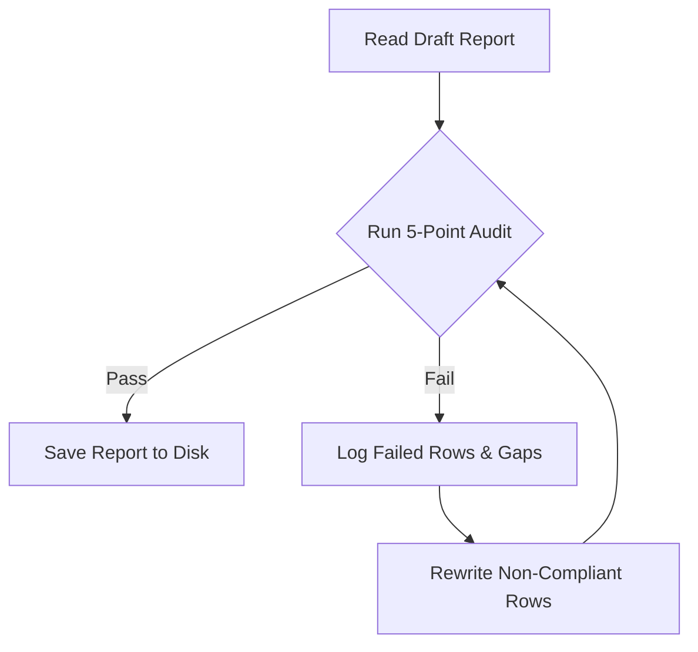

# CONTENT REVIEWER & QUALITY AUDITOR

Defines the quality inspection checklists, vocabulary filters, and self-correction workflows required to audit the Vietnamese Socratic newsletter content before final publication. 

This skill acts as a strict **Quality Gate (Critic-Builder)** to ensure visual and editorial excellence across all published reports.

---

## Core Rules

### DO:
- **Strict Hook Structure:** Ensure copywriting hooks in the **Ứng Dụng Thực Tế** column strictly follow: `<strong>Muốn/Cần [mục tiêu]</strong> nhưng <strong>ngại/sợ/lo ngại [rào cản]</strong>.`
- **Strict Metaphor Format:** Ensure Socratic metaphors in the **Điểm Độc Đáo** column strictly follow: `<strong>[Tên_Ẩn_Dụ]</strong> - [Mô tả ẩn dụ cuộc sống dễ hiểu]<br><strong>CƠ CHẾ KỸ THUẬT</strong>: [Mô tả cơ chế hoạt động thực tế dưới codebase]`
- **Technical Grounding:** Verify that every metaphor bridges the everyday analogy with concrete codebase realities (e.g., C binary, SQLite, local LLM, sandbox, GitHub Actions).
- **Preserve English Jargon:** Keep all standard technical terms in the approved list in English.
- **Standard Bullet Points:** Ensure highlighted features are structured with standard solid black bullets (`• `) and separated by `<br>`.
- **Verify HTML Closure:** Check that all opening tags (`<strong>`, `<a>`, `<small>`) are closed correctly.

### DO NOT:
- **No Emojis:** Ban all emojis or decorative special characters in the **Tính Năng Nổi Bật** column.
- **No AI-isms:** Ban cliché AI phrases (e.g., "kỷ nguyên số", "về cốt lõi", "tóm lại", "không chỉ X mà còn Y").
- **No Soft Synonyms:** Do not allow hooks to use weak synonyms (e.g., "gặp khó khăn", "không có thời gian", "ngán ngẩm") in place of the strict copywriting verbs (`ngại`, `sợ`, `lo ngại`).
- **No Pure Fiction:** Do not allow metaphors that explain how the tool works in terms of the metaphor only, without linking it to the real tech stack.

---

## When to Activate

Use this skill when:
- Compiling daily, weekly, or monthly trending reports.
- Performing the pre-publish quality gate check before writing files to disk.
- Auditing existing reports for layout, spelling, and copywriting quality.

Do NOT use this skill when:
- Gathering raw repositories from GitHub or Trendshift (use `get_trending` and `get_repo_details`).
- Writing raw research logs or codebase summaries.

---

## Style Best Practices & Anti-Patterns

### Best Practices (Thực Hành Tốt)
*   **Declarative Copywriting:** Hooks should state the user's objective and barrier directly and concisely.
*   **Codebase Grounding:** Always read the repository details (README, code files) to extract the real tech mechanisms (e.g. "runs as a Rust binary", "uses Playwright stealth engine", "reads Google Discovery API").
*   **Consistent Row Widths:** Verify that the HTML table columns strictly define the correct width percentages: `5%` | `10%` | `20%` | `35%` | `30%`.

### Anti-Patterns (Lỗi Cần Tránh)
*   *Lỗi Dùng Từ Cũ:* Writing `biên tập video` instead of `video editor` / `trình dựng video`.
*   *Lỗi Việt Hóa Khiên Cưỡng:* Translating common developer terms like `cron job` to `công việc chạy định kỳ` or `reverse-engineer` to `kỹ thuật đảo ngược`. Keep them in English.
*   *Lỗi Ẩn Dụ Thiếu Thực Tế:* Explaining `obsidian-skills` as a "digital garden" without explaining that it actually runs on standard format markdown files, Canvas, and CLI commands.

---

## Quality Audit Rubric

For every row in the table, perform a strict 5-point quality checklist:

| Check | Focus Area | Pass Criteria | Action on Failure |
|---|---|---|---|
| **1. Hook Verbs** | Hook Pattern | Hook starts with `<strong>Muốn` or `<strong>Cần` and barriers start with `ngại`, `sợ`, or `lo ngại`. | Rewrite the hook using the correct active verbs. |
| **2. Metaphor Format** | Format | Formatted with `<strong>[Analogy]</strong> - [Analogy Description]<br><strong>CƠ CHẾ KỸ THUẬT</strong>: [Technical Explanation]`. | Restructure into the two explicit segments. |
| **3. Tech Details** | Grounding | Metaphor includes concrete tech terms (frameworks, APIs, runtimes, database engines) from the repository code. | Research the repository data again and inject factual codebase details. |
| **4. Jargon Check** | Terminology | Preserves all loanwords in English (e.g. *MCP, sandbox, next.js, agent*). | Revert translated terms back to their original English words. |
| **5. Emojis & Bullets** | Features | Features use `• ` bullets, separate with `<br>`, and contain no emojis. | Strip emojis and reformat bullet points cleanly. |

---

## Unified English Jargon Reference

Do not translate the following standard terms into Vietnamese. Keep them in English:

| Category | Terms to Keep in English |
|---|---|
| **AI & Architecture** | *AI, agent, subagent, prompt, LLM, VLM, RAG, embedding, token, context, rules/instincts, capsule, sandbox, meta-skill, knowledge graph* |
| **Tech & Frameworks** | *Next.js, HTML/CSS, WebAssembly (Wasm), IPC, ambient authority, Playwright, Selenium, stealth engine, YAML front-matter, Markdown prose, JSON/Markdown, OSINT, CTF* |
| **Tools & Platforms** | *GitHub Actions, Webhook, Cursor, CLI, QA, Neural Engine, Apple Silicon, Hacker News, Reddit, X, Bilibili, YouTube, Y Combinator* |
| **Generic Dev Terms** | *dev, script, code, local, offline, cloud, dashboard, video editor, toolchain, research, voiceover, audit, reverse-engineer, reverse-engineering, scene, subtitle, cron job* |

---

## Self-Correction Loop Workflow

When auditing drafts, the agent must perform the following Critic-Builder loop:



### Self-Correction Example

#### ❌ Non-Compliant Draft:
*   **Hook:** `<strong>Muốn tạo tài khoản Gmail</strong> nhưng gặp khó khăn vì bị chặn số điện thoại.` (Fails Check 1: uses "gặp khó khăn" instead of ngại/sợ/lo ngại).
*   **Metaphor:** `<strong>Người đăng ký tự động</strong> - Giống như robot tự gõ phím đăng ký tài khoản.` (Fails Check 2 & 3: lacks "CƠ CHẾ KỸ THUẬT" segment and lacks technical details under the hood).
*   **Features:** `🚀 Tạo hàng loạt tài khoản • Tự động nhận tin nhắn SMS.` (Fails Check 5: uses emoji and incorrect bullet layout).

#### 🔄 Reviewer Feedback:
- Hook must use `sợ` or `lo ngại` instead of `gặp khó khăn`.
- Metaphor is too generic, needs `<br><strong>CƠ CHẾ KỸ THUẬT</strong>` and must explain browser automation / OTP integration.
- Remove emoji `🚀` and format list with `• ` and `<br>`.

#### ✅ Compliant Rewritten Row:
*   **Hook:** `<strong>Muốn tạo hàng loạt tài khoản Gmail</strong> nhưng <strong>sợ bị Google chặn do xác minh số điện thoại hoặc cơ chế phát hiện bot</strong>.`
*   **Metaphor:** `<strong>Dây chuyền sản xuất tài khoản</strong> - Tự động hóa toàn bộ quy trình đăng ký tài khoản mới mà không bị Google phát hiện.<br><strong>CƠ CHẾ KỸ THUẬT</strong>: Kịch bản Python tự động điều khiển trình duyệt giả lập qua Selenium/Playwright kèm các gói chống phát hiện (stealth engine), tích hợp API dịch vụ nhận mã OTP tự động (5sim) để vượt qua xác minh số điện thoại.`
*   **Features:** `• Hỗ trợ tạo tài khoản Gmail tự động số lượng lớn với giao diện đồ họa trực quan.<br>• Vượt qua bộ lọc bot của Google nhờ cơ chế giả lập vân tay trình duyệt (fingerprint spoofing) và tự động nhận OTP qua API.`

---

## Verification & Sanity Check

Before writing the final file, execute the local Node.js script:
```bash
node verify_report.js
```
Saving the report is **only allowed** when this script exits with code `0`.

---

## Limitations
- Use this skill only when the task clearly matches the scope described above.
- Do not treat the output as a substitute for environment-specific validation, testing, or expert review.
- Stop and ask for clarification if required inputs, permissions, safety boundaries, or success criteria are missing.
